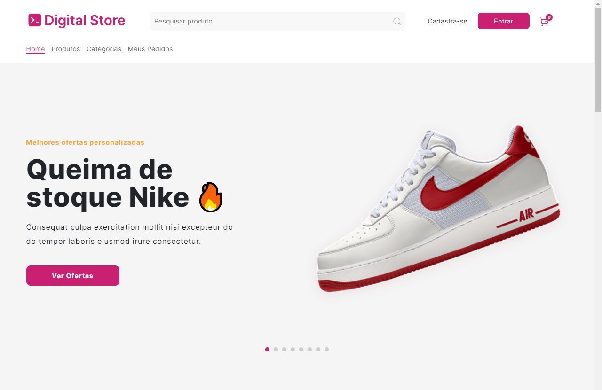
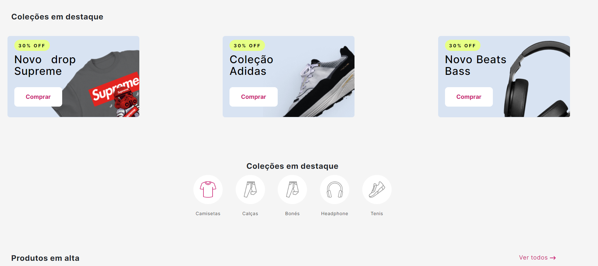
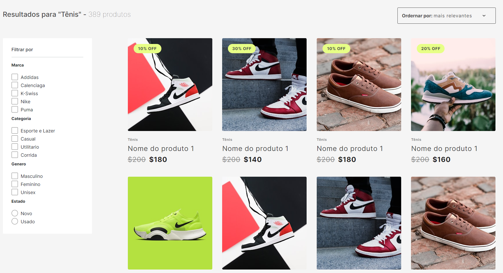
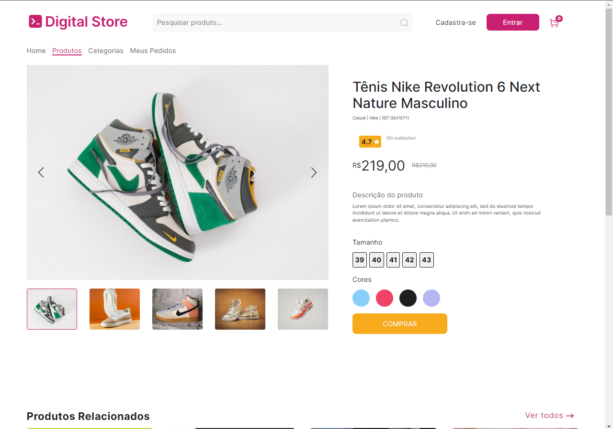

# Digital Store

## Descrição do Projeto

### Projeto React + Vite, feito para conclusão da parte de front end do curso de Full-Stack da Digital College
## Tecnologias Utilizadas

- **Frontend:**

  - [React.js](https://reactjs.org/)
  - [Bootstrap](https://getbootstrap.com/)
  - [Javascript](https://developer.mozilla.org/pt-BR/docs/Web/JavaScript)
  - [Html](https://developer.mozilla.org/pt-BR/docs/Web/HTML)
  - [styled-components](https://styled-components.com/)

### Modo de instalação

### Pré-requisitos

- Node.js e npm instalados

## Instalação

- 1_ clonar o repositorio
- 2_ npm install // para instalar os nodulos do node
- 3_ npm run dev // inicia o servidor dando acesso a aplicação

- ou utilizar o link para o proprio projeto: (https://geracao-tec-store.vercel.app/)

## Equipe de Desenvolvimento

A equipe de desenvolvimento é composta por cinco pessoas, todas atuando como desenvolvedores:

- Lucas Maciel
- Wendel de Oliveira
- Mateus Jairam
- Levi Estavao
- Osmar

## Imagens

Aqui estão algumas imagens relacionadas ao projeto:

