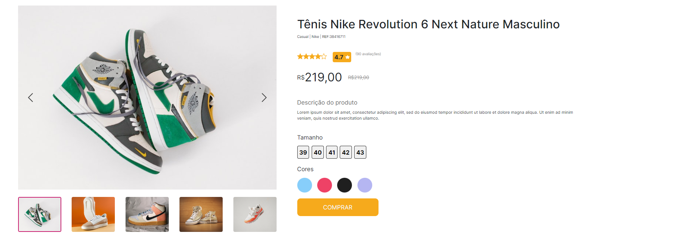

# Digital Store

## Descrição do Projeto

O projeto **Digital Store** é focado na criação do Frontend de uma loja online.

## Tecnologias

- **Linguagens de Programação:** JavaScript, HTML, CSS
- **Frameworks e Bibliotecas:** React, styled-components, bootstrap, react-router-dom

## Equipe de Desenvolvimento

A equipe de desenvolvimento é composta por cinco pessoas, todas atuando como desenvolvedores:

- Lucas Maciel
- Wendel de Oliveira
- Mateus Jairam
- Levi Estavao
- Osmar

## Imagens

Aqui estão algumas imagens relacionadas ao projeto:

# Projeto React + Vite, feito para conclusão da parte de front end do curso de Full-Stack da Digital College

### Link do Figma do projeto: 
 https://www.figma.com/design/cfb4F7ZXMFQmvmTn3PKI4z/DRIP-STORE---DIGITAL-COLLEGE?node-id=101-2&t=fg7EppJRC8KP8rcR-0
### Repositorio do desafio: 
 [https://github.com/Geracao-Tech-2024/Digital-Store](https://github.com/digitalcollegebr/projeto-digital-store)
